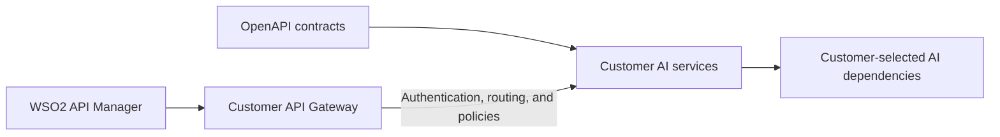

# Build and Integrate Custom AI Services with WSO2 API Manager

This directory provides OpenAPI contracts and reference implementations for the backend services used by WSO2 API Manager AI features.

Use these resources to build your own AI services. The sample source code is provided only as a reference and is not intended to be deployed unchanged in a customer environment. Your implementation can use any programming language, model provider, or data store as long as it follows the applicable OpenAPI contract.

## What is provided

For local setup and run instructions, open the README for the service you want to use.

| Directory | API Manager feature | Purpose | Local setup | Contract |
| :--- | :--- | :--- | :--- | :--- |
| `spec_populator_service` | Marketplace Assistant | Indexes, removes, and counts API records in the vector store | [README](spec_populator_service/README.md) | [openapi.yaml](spec_populator_service/openapi.yaml) |
| `marketplace-assistant-api` | Marketplace Assistant | Retrieves indexed APIs and answers marketplace queries | [README](marketplace-assistant-api/README.md) | [openapi.yaml](marketplace-assistant-api/openapi.yaml) |
| `api-design-assistant` | Design Assistant | Generates and refines API specifications from natural-language input | [README](api-design-assistant/README.md) | [openapi.yaml](api-design-assistant/openapi.yaml) |
| `api-chat-agent` | API Chat | Prepares a REST API definition and manages API Chat execution steps | [README](api-chat-agent/README.md) | [openapi.yaml](api-chat-agent/openapi.yaml) |

The OpenAPI files are the public contracts and should be treated as the source of truth. The reference source demonstrates one possible implementation and may temporarily differ from the approved contracts while it is being aligned.

## Integration overview



The integration has seven main steps:

1. Select the API Manager AI features that you want to enable.
2. Implement the corresponding service contracts.
3. Deploy the services in your environment.
4. Expose the service resources through an API Gateway.
5. Create one Gateway application and subscribe it to the AI service APIs.
6. Configure the Marketplace Assistant `keyID` policy when Marketplace Assistant is enabled.
7. Configure and validate the integration in API Manager.

## Prerequisites

Before starting, make sure that you have:

- A WSO2 API Manager installation that contains the AI service extensibility update (4.6.0.39) and the configuration properties described in this guide
- An API Gateway that API Manager can reach
- A deployment environment for your custom services
- The model, vector database, cache, or other dependencies required by your implementation
- Access to create Gateway APIs, applications, subscriptions, and credentials

Confirm that your API Manager update is compatible with the contracts in this directory. If an older API Manager implementation uses a different path or transport-level input, use the supported resource configuration or Gateway mediation for that version. Keep the customer service itself aligned with the published OpenAPI contract.

## Step 1: Select the required features

You only need to implement and configure services for the features that you plan to enable.

| Feature | Required contract | Important dependency |
| :--- | :--- | :--- |
| Marketplace Assistant | `spec_populator_service` and `marketplace-assistant-api` | Both services must use the same indexed data, embedding configuration, and `keyID` |
| Design Assistant | `api-design-assistant` | The service must preserve conversation state by `sessionId` as defined by the contract |
| API Chat | `api-chat-agent` | The current contract and reference implementation support REST APIs |

## Step 2: Implement contract-compatible services

Build each selected service against its OpenAPI specification. Your implementation must preserve:

- Resource paths and HTTP methods
- Required query, path, and header parameters
- Required request fields and data types
- Response and error schemas
- Exact success status codes expected by API Manager
- Validation behavior required by the contract

The status codes are part of the integration contract. For example, a resource defined to return `201` on success must not return `200`, even when the response body indicates success.

Request schemas that allow additional properties can receive optional customer-specific fields added by the API Manager request property enricher. Read the fields your service needs and ignore supported optional fields that it does not use. Response DTOs can be strict, so do not add response fields that are not allowed by the corresponding response schema.

### Marketplace Assistant implementation requirements

Marketplace Assistant uses two cooperating services:

- The Spec Populator Service writes and removes API records.
- The Marketplace Assistant service reads those records when answering user queries.

Both services must use compatible storage and embedding behavior. They must also receive the same `keyID`. A record written with one `keyID` cannot be retrieved or removed using another value.

You can replace the model provider or vector database used by the reference implementation. The replacement must still produce the behavior and response formats defined by the contracts.

## Step 3: Deploy the customer services

Build and deploy your implementations using your normal application platform. The deployment method is customer-specific and is not prescribed by this repository.

Before connecting API Manager, verify each service directly against its OpenAPI contract. At minimum, confirm that:

- Each required resource is reachable.
- Successful and failed requests return the documented status codes and schemas.
- Required state, model, and data-store dependencies are available.
- Logs do not expose credentials or customer prompt data.

The reference contracts declare no service-level security because the initial integration protects the services through the API Gateway. Keep backend services private to the Gateway whenever possible. Additional backend protection can be added if required by your deployment architecture.

## Step 4: Expose the services through an API Gateway

Create a Gateway API for each custom service. You can import the corresponding OpenAPI file or create the Gateway API manually, provided that the exposed behavior remains compatible with the contract.

For each Gateway API:

1. Configure the deployed customer service as the backend.
2. Expose the operations required by the selected API Manager feature.
3. Enable OAuth authentication for requests from API Manager.
4. Add any required route mapping or mediation policies.
5. Publish the API.

The public Gateway paths do not need to use the sample paths or API contexts shown in this repository. Configure the full exposed resource paths in `deployment.toml`. For example, if the Gateway exposes the Spec Populator operation at `/company-ai/1.0.0/vectors`, use that path in the corresponding API Manager property.

Use Gateway mediation for transport-level adaptations such as external-to-backend path mapping and `keyID` injection. The backend service should still implement the published request and response contract.

## Step 5: Create an application and subscriptions

Create one application for API Manager to invoke the custom AI service APIs.

1. In the Developer Portal, create an application for the AI service integration.
2. Subscribe the application to every Gateway API required by the enabled features.
3. Generate the production consumer key and consumer secret.
4. Base64-encode the value in the following form, without a trailing line break:

   ```text
   <consumer-key>:<consumer-secret>
   ```

5. Use the encoded value as the `[apim.ai].key` value.

For example, on a Unix-like system:

```bash
printf '%s' '<consumer-key>:<consumer-secret>' | base64
```

Base64 encoding does not encrypt the credentials. Store the value as a secret and do not commit it to source control.

Use the same application for the Marketplace Assistant chat and Spec Populator APIs. The Marketplace Assistant `keyID` is derived from the application's consumer key, so using different applications would create different data partitions.

## Step 6: Add the Marketplace Assistant `keyID` policy

Skip this step if Marketplace Assistant is not enabled.

Marketplace Assistant uses the `keyID` query parameter to partition indexed records. API Manager does not add this parameter through the current AI service configuration. The Gateway must derive it from the validated access token and append it before forwarding the request.

In WSO2 API Gateway, the application's consumer key is available as `api.ut.consumerKey`. Attach the policy to all Marketplace Assistant and Spec Populator operations that accept `keyID`.

| Service | Operations requiring `keyID` |
| :--- | :--- |
| Marketplace Assistant | `POST /marketplace-assistant` |
| Spec Populator Service | `POST /vectors`, `DELETE /vectors`, `DELETE /vectors/{uuid}`, `GET /vectors/count`, and `POST /vectors/bulk` |

The following Synapse sequence shows the required behavior:

```xml
<sequence name="ai-inject-keyid" xmlns="http://ws.apache.org/ns/synapse">
    <property name="rest_postfix"
              expression="get-property('axis2','REST_URL_POSTFIX')"/>
    <filter regex=".*\?.*" source="get-property('rest_postfix')">
        <then>
            <property name="REST_URL_POSTFIX"
                      scope="axis2"
                      type="STRING"
                      expression="fn:concat(get-property('rest_postfix'),
                                  '&amp;keyID=',
                                  get-property('api.ut.consumerKey'))"/>
        </then>
        <else>
            <property name="REST_URL_POSTFIX"
                      scope="axis2"
                      type="STRING"
                      expression="fn:concat(get-property('rest_postfix'),
                                  '?keyID=',
                                  get-property('api.ut.consumerKey'))"/>
        </else>
    </filter>
</sequence>
```

For another Gateway implementation, read the `azp` claim from the validated access token and append that value as the `keyID` query parameter.

The `keyID` must:

- Be identical for indexing, retrieval, removal, and count operations
- Remain stable after records are indexed
- Meet the length restrictions defined by the OpenAPI contract

Do not regenerate the consumer key after indexing APIs unless you also re-index the records under the new `keyID`.

If `apictl ai delete` is used with `DELETE /vectors`, also map its `TENANT-DOMAIN` request header to the required `tenant_domain` query parameter as described in the Spec Populator contract.

## Step 7: Configure API Manager

Add the AI service configuration to `<API-M_HOME>/repository/conf/deployment.toml`.

The following example enables all three features. Replace the host names, credentials, API contexts, versions, and paths with the values exposed by your Gateway.

```toml
[apim.ai]
enable = true
endpoint = "https://ai-gateway.example.com"
token_endpoint = "https://idp.example.com/oauth2/token"
key = "<base64-encoded-consumer-key-and-secret>"

marketplace_assistant_enable = true
api_chat_enable = true
design_assistant_enable = true

marketplace_assistant_publish_api_resource = "/spec-populator/1.0.0/vectors"
marketplace_assistant_remove_api_resource = "/spec-populator/1.0.0/vectors"
marketplace_assistant_api_count_resource = "/spec-populator/1.0.0/vectors/count"
marketplace_assistant_chat_resource = "/marketplace-assistant/1.0.0/marketplace-assistant"

api_chat_prepare_resource = "/api-chat/1.0.0/prepare"
api_chat_execute_resource = "/api-chat/1.0.0/chat"

design_assistant_chat_resource = "/design-assistant/1.0.0/chat"
```

The Marketplace Assistant remove property must contain the base resource path. API Manager appends the API UUID when invoking the delete operation.

Disable features that you have not implemented:

```toml
[apim.ai]
api_chat_enable = false
design_assistant_enable = false
```

Restart API Manager after changing `deployment.toml`.

### Optional: Add customer-specific request properties

If your service requires optional fields that API Manager does not include in its standard payload, implement the API request property enricher extension and configure the implementation class:

```toml
[apim.ai]
property_enricher_impl = "com.example.apim.ai.CustomerAIRequestPropertyEnricher"
```

Create a class that extends `AbstractAIRequestPropertyEnricher`, override only the feature methods that require extra values, and return the additional properties as a map. The implementation must have a public no-argument constructor.

The enricher can append customer-specific top-level fields, such as an external user identifier, according to the feature and request context. It cannot overwrite standard payload fields. The customer service must treat the additional fields as optional extensions to the published contract.

Package the implementation as a JAR, place it in `<API-M_HOME>/repository/components/lib`, configure its fully qualified class name, and restart API Manager. The implementation should be stateless and thread-safe because API Manager can reuse it across concurrent requests.

## Validate the integration

Validate one layer at a time so that routing, authentication, and service-contract problems can be isolated.

1. Call each customer service directly and validate the response against its OpenAPI contract.
2. Call each published Gateway API using the integration application's access token.
3. Confirm that the Gateway routes every configured path to the intended backend operation.
4. For Marketplace Assistant, confirm that the Gateway appends the same non-empty `keyID` to indexing, chat, removal, and count requests.
5. Add or publish an API and confirm that the Spec Populator creates its record.
6. Query Marketplace Assistant and confirm that it can retrieve the indexed API.
7. Test Design Assistant and API Chat if those features are enabled.
8. Confirm that any optional enriched properties reach the customer service.
